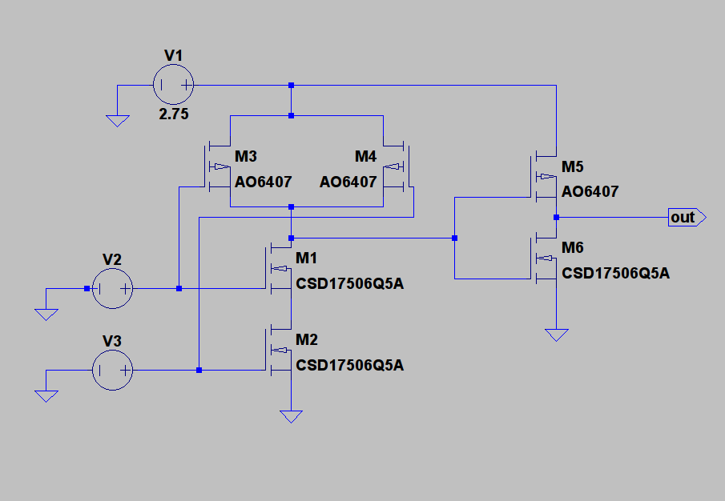
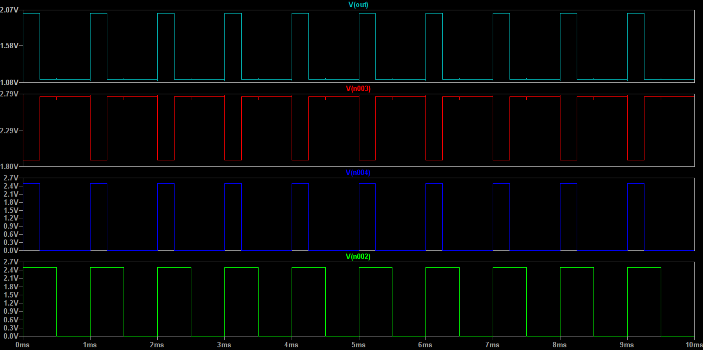

# CMOS Designs of StrongPC Project

As we want to design and implement what we designed in logic gates level, we've decided to use CMOS technology. 
In this repository, we'll publish everything we've designed and implemented. 

## MOSFET Models
For **NMOS** we've used *Texas Instruments CSD17506Q5A* and for **PMOS** we've used *Alpha and Omega 6407* Transistors. 

## Circuits
1) NOT Gate :

2) AND Gate :

## Waveform Analysis 
1) NOT Gate:

2) AND Gate:

Hint : Green and Dark Blue waves are inputs, red wave is output of CMOS NAND, and input of NOT gate, Light Blue wave is the output.

